# Java Cloud Azure Day 3 - Virtual Machines

## Learning Objectives

- Learn the steps necessary to create a new VM on Azure
- Configure the VM to act as a server
- Deploy a Spring App as a Jar file to the server
- Run the Spring App remotely and access the API endpoints

## Create the VM

- Go to the Home on the Azure Portal page, click on the Hamburger Menu at the top left and choose Virtual Machines in the list that opens up.

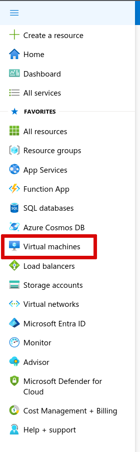

- In the Overview page that opens, click on `Create` and choose the first option `Azure virtual machine`.

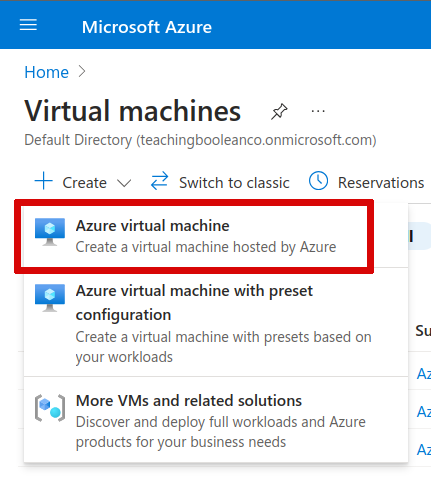

- In the page that opens make sure you have the following settings chosen
  - `Azure subscription 1` for subscription
  - `students_infrastructure` for Resource Group
  - Choose a meaningful name for the Virtual machine name


- Find the section marked Region and make sure you select the region you were assigned to.


- Most of the options can stay as they are, but scroll to the bottom of the screen and change the `Select inbound ports` setting to have all 3 options (HTTP, HTTPS and SSH) chosen

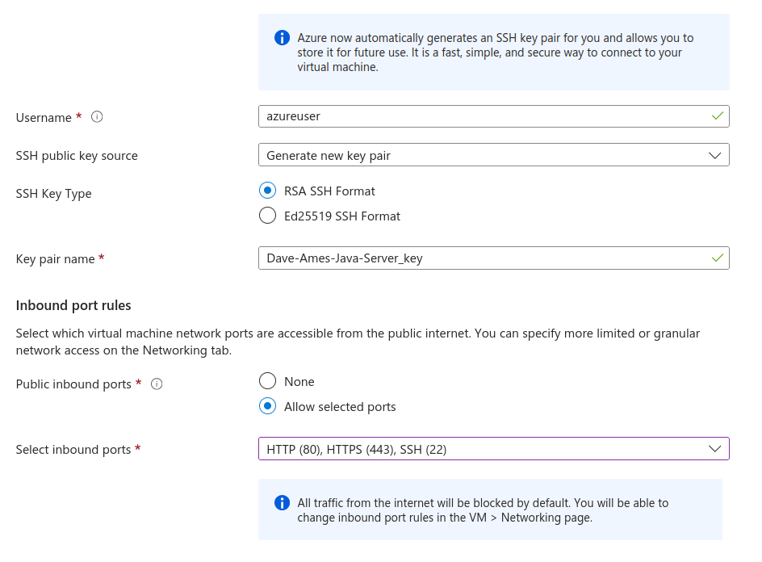

- Click on `Next: Disks`
- In the new screen find the option for `OS disk type` and click on it. Change the selected option to `Standard HDD`

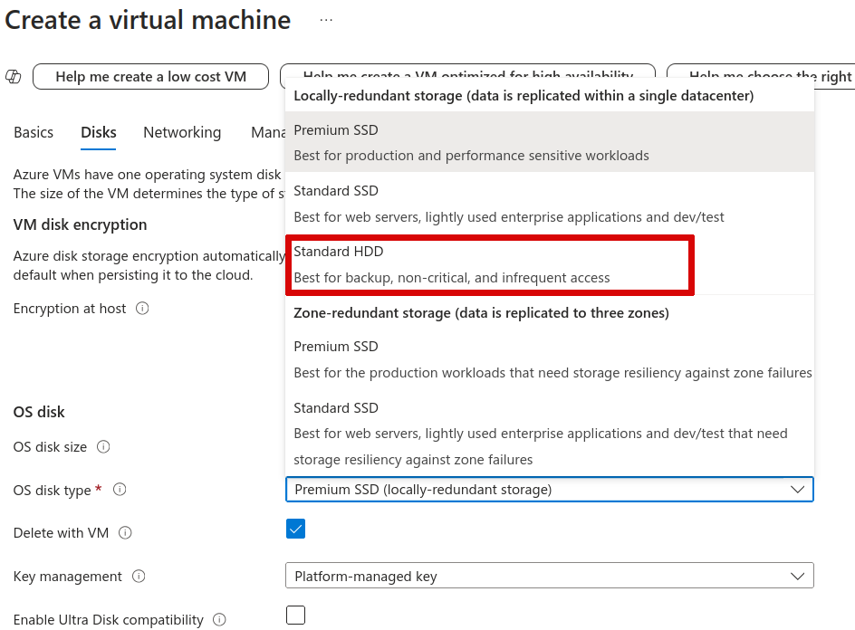

- Scroll to the bottom of the screen and choose `Next: Networking`
- Click on `Create new` next to `Virtual network` to create a new network for you VM to run on.
- In the resulting window give the network a suitable name and click OK to create it (I typically give it the same name as my VM with the letters VN appended).

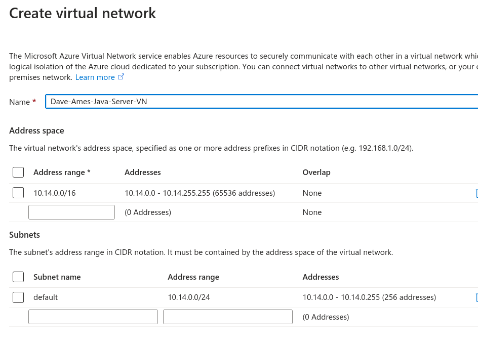

- Make sure `NIC network security group` is set to `Basic`
- `Public inbound ports` should have `Allow selected ports` set and the three values set previously should be showing (you can click and select them if they aren't)

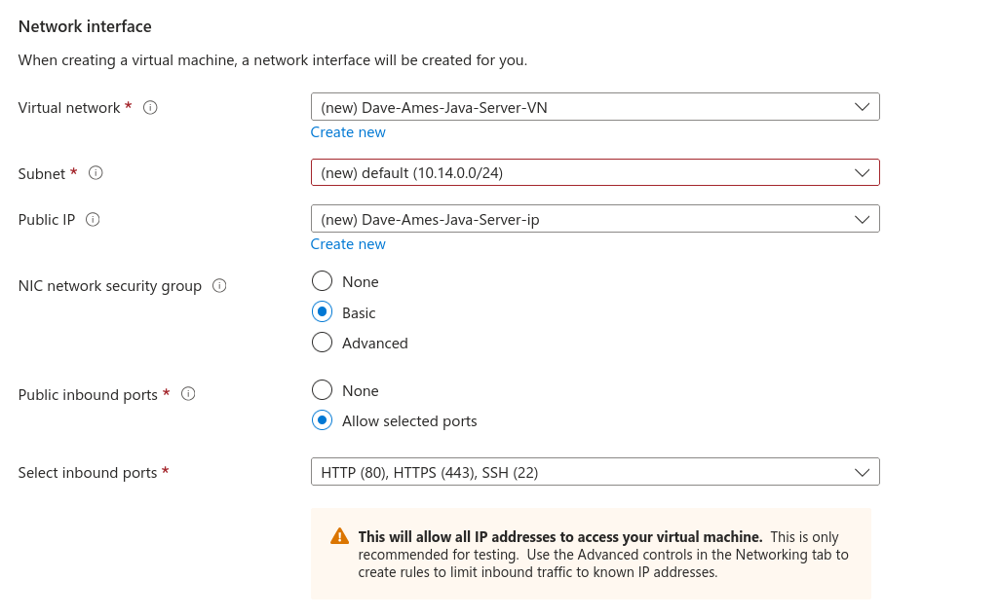

- Select the option to `Delete public IP and NIC when VM is deleted` then scroll to the bottom and click on `Next: Management`
- None of these settings, nor any from the subsequent steps, need configuring so you can click on `Review + Create`
- In the final window review your settings and click on the `Create` button if everything looks okay.
- Select the option to download the key file you selected for generation previously. You will need this when you want to SSH into the Virtual Machine shortly.

You will then need to wait a couple of minutes for the VM to be created and deployed.

## Configure the Virtual Network to Allow us to Connect to Port 5000

- Once the VM has finished being created go to its Overview page you should see something like this

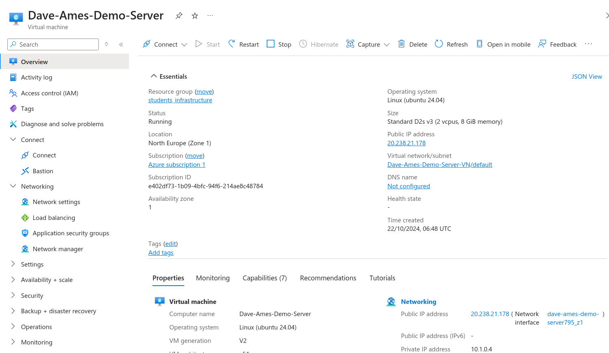

- Select `Network settings` from the menu on the left and scroll down to the `Inbound port rules` section, click on `Create port rule` and choose `Inbound port rule`
- Change the `Destination port ranges` value to be 5000 (or whatever port you have your Spring App configured to listen on) and the `Protocol` to `TCP`.

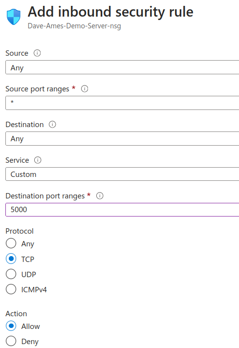

- Accept the default name and click `Add`
- The `Inbound port rules` section will now look something like this

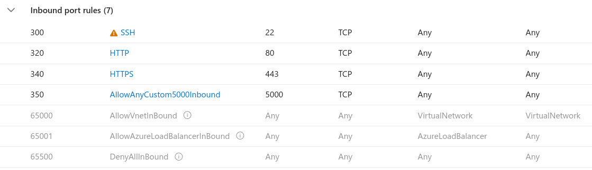

## SSH into the Virtual Machine and Install Java

- When you created the Virtual Machine you also downloaded a Public Key file to use when connecting to the server over SSH, the example one I downloaded is called `demo-server-key.pem` and it will be used in the next section. **You will need to make sure you use the name of your own key file in place of this in the following commands**
- Open a Terminal in the same folder that contains you key file (the one ending with `.pem`)
- In the Portal find the public IP Address of your server - mine is `20.238.21.178`
- Use the SSH command to connect to your server in the terminal as follows (you need to use your key file name and your IP address)

```bash
ssh -i demo-server-key.pem azureuser@20.238.21.178
```
- This logs me into the machine at that IP address, using the key file as the user named `azureuser` which was the default username we used when setting up the server (if you changed it you will need to use the other name you changed it to).
- If you have the correct set up you should connect to the server (you may have to agree yes to certain questions first)
- In the new command prompt that has appeared you will need to install Java so that you can use it shortly, use the following command and agree to the requests so that it will install all of the dependencies.

```bash
sudo apt install openjdk-21-jdk
```

- This can take a while to run, wait until it completes before testing that Java has successfully installed. Run the following command and you should get similar output to what is shown

```bash
java --version
```
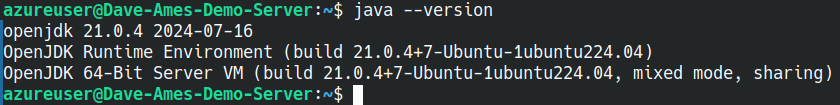

- Now we need to exit from the server environment so we can copy the Jar file onto our server, type `exit` in the terminal and hit enter, you should see the prompt change back to your local machine.
- Make sure you have the working Jar file you are going to deploy to the server in the same folder as the key file you used before. 
- My Jar file is called `TodoApp-0.0.1.jar` if yours has a different name then you will need to use that new name in the following command and the subsequent commands when running it on the server.
- Using the `demo-server-key.pem` file, and the `TodoApp-0.0.1.jar` files that are both in the current folder I use the following command to copy the Jar file to the server at `20.238.21.178` logging in as the `azureuser` username and putting the uploaded file into the `/home/azureuser` folder on the remote server.

```bash
scp -i demo-server-key.pem TodoApp-0.0.1.jar azureuser@20.238.21.178:/home/azureuser
```

- When this successfully completes use `ssh` to login to the server once more. Then at the command prompt do `ls` to check the contents of the current folder. You should see something like this.

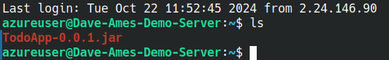

- Run the Spring App on the server by typing the following

```bash
java -jar TodoApp-0.0.1.jar &
```

- The `&` detaches the process from the terminal and means that when it completes booting up, you can type `exit` and log back out of the server.
- If you now visit the IP address of your Virtual Machine in the browser, but using `http` not `https` and port 5000 followed by the endpoints you have configured you should see the expected result. In my case that is the following (with data I already placed in the API)

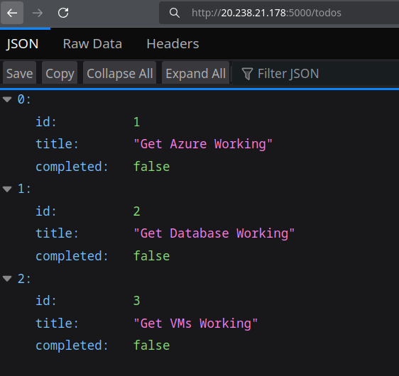

## Core and Extension Activity

- Deploy your Spring App to a server running on an Azure VM.
- Document your success with screenshots as we will probably be deleting the machines at the end of the day in preparation for tomorrow.